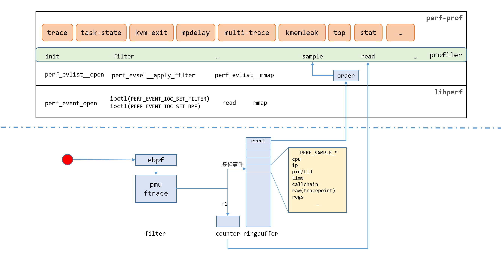

# 基础框架

基于`libperf`和`libtraceevent`库实现简单的监控框架，提供比perf更灵活的特性。

- 数据不落盘。
- 数据过滤，基于tracepoint的过滤机制，减少数据量。
- 数据实时处理并输出。不需要存盘后再处理。
- 基于perf_event_open系统调用。

虽然比perf更灵活，但不能替代perf。perf灵活的符号处理，支持大量的event，支持很多硬件PMU特性。




## 1 事件表示

事件基本形式：

```
Event selector. use 'perf list tracepoint' to list available tp events.
  EVENT,EVENT,...
  EVENT: sys:name[/filter/ATTR/ATTR/.../]
  filter: ftrace filter
  ATTR:
      stack: sample_type PERF_SAMPLE_CALLCHAIN
      max-stack=int : sample_max_stack
      alias=str: event alias
      top-by=field: add to top, sort by this field
      top-add=field: add to top
      ptr=field: kmemleak, ptr field, Dflt: ptr=ptr
      size=field: kmemleak, size field, Dflt: size=bytes_alloc
      delay=field: mpdelay, delay field
      key=field: multi-trace, key for two-event
      untraced: multi-trace, auxiliary, no two-event analysis
```

- **sys:name**，tracepoint点，可以通过`kprobe,uprobe`动态增加，还可以利用内核模块动态增加，利用ebpf动态增加。
- **filter**，事件过滤器，目前使用的是ftrace过滤器。可以扩展到ebpf过滤器。ebpf可以过滤一条网络流等复杂场景。
  - 过滤事件，用户态只分析关注的事件，减少干扰以及无效的事件，提升性能。

- **ATTR**，可以指定事件的属性。属性分为*公共属性*和*特定profiler的属性*。比如，栈属性是公共的。top-by属性用于top profiler。


## 2 事件关系

- 直接显示。显示过滤后的事件，事件发生时的内核栈、用户栈。事件的各种属性值。事件的帮助信息。
- 单个事件，基本关系。

  - 字段。能够提取事件的各个字段。
  - 栈。用户态栈和内核态栈。栈符号解析。
  - key-value栈。key：栈，用唯一栈id表示。value：栈次数，栈对应的内存分配大小，栈对应IO量、网络包量。
  - 排序。事件按时间排序。
- 2个事件之间，基本关系。

  - 关联关系。2个事件通过关键字相互关联。key：cpu、pid、五元组、bio。
  - 发生关系。成对的事件，只发生其中一个。如，内存泄露，只有分配事件，没有释放事件。
  - 延迟关系。事件前后延迟。延迟统计方法：最大值，最小值，均值，总和，次数，方差，延迟热图。
- 多个事件之间，基本关系。

  - 多对一。可以转化成一对一的事件对。利用2个事件基本关系进行分析。
  - 多对多。利用2组事件的基本关系分析。 多个内存分配入口，对应一个内存释放。
  - 一对一对一。事件串联关系。如，经过每个事件的延迟，系统调用路径上的多个点，网络协议栈多个点。
- 按进程粒度分析事件。top方式呈现事件次数，事件累计值，事件延迟方差值等。
- 按cpu视角分析事件。top方式呈现事件次数，事件累计值，事件延迟方差值等。
- 按网卡视角分析事件。需要ebpf过滤器，过滤特定流。进行流分析，流统、微突发，流往返延迟。
- 按块设备视角分析事件。bio和req视角。bio延迟，req延迟，毛刺。
- cpu硬件pmu事件。cache抖动，指令延迟。


## 3 profiler

剖析器(profiler)，分析事件的各种关系。profiler分为框架性的和特定用途的。

- 框架性的需要通过参数指定具体的分析事件。
- 特定用途的则采用内建事件，不需要指定任何事件。

profiler 通过打开特定的perf_event，不断收集ring buffer上的事件进行处理分析，分析完直接丢弃事件，事件不会存储，实时处理。

```c
typedef struct monitor {
    struct monitor *next;
    const char *name;
    int pages;
    int reinit;
    bool dup; //dup event
    bool order; // default enable order
    struct perf_cpu_map *cpus;
    struct perf_thread_map *threads;

    void (*help)(struct help_ctx *ctx);

    int (*init)(struct perf_evlist *evlist, struct env *env);
    int (*filter)(struct perf_evlist *evlist, struct env *env);
    void (*deinit)(struct perf_evlist *evlist);
    void (*sigusr1)(int signum);
    void (*interval)(void);
    void (*read)(struct perf_evsel *evsel, struct perf_counts_values *count, int instance);
    
    /* PERF_RECORD_* */
    //PERF_RECORD_SAMPLE			= 9,
    void (*sample)(union perf_event *event, int instance);
	
	...
} profiler;
```

- **init**，初始化perf_event_attr，并添加到perf evlist上。
- **filter**，过滤事件。
- **read**，读取counter值。
- **sample**，处理采样事件。

